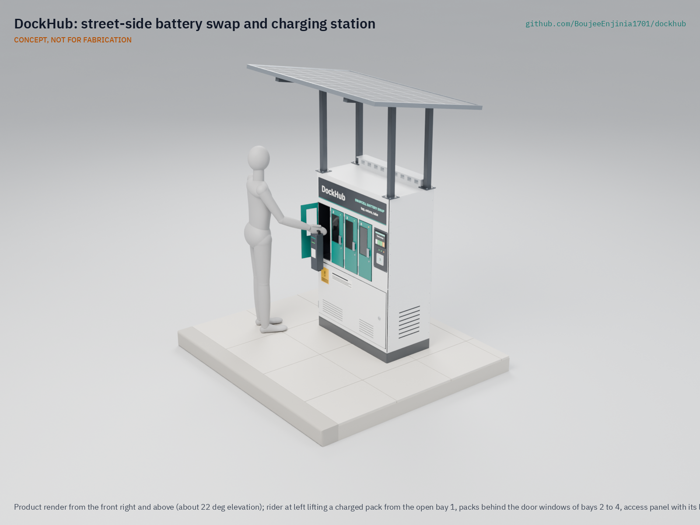

# DockHub

  

**Area:** Smart Cities · **TRL:** 3 of 9 (proof of concept on paper) · **Prototype budget:** about $1,200 USD (four-bay cabinet, two bays fitted) · **Difficulty:** 4 of 5

A street-side battery swap and charging station for SwapCell packs, serving e-bikes, cargo trikes and delivery riders with charged batteries in seconds.

[Exploded render](media/render-exploded.png) · [Detail render](media/render-detail.png) · [Interactive 3D model](media/viewer.html) · [Concept blueprint (PDF)](media/concept-blueprint.pdf) · [General arrangement DKH-DWG-001 (PDF)](cad/drawings/DKH-DWG-001.pdf) · [Sizing note](docs/04-calcs/01-sizing.md) · [Review note](docs/REVIEW.md)

## Concept rationale

Swapping moves charging out of homes and into a monitored steel cabinet, and turns hours at a socket into about 30 seconds at the curb. DockHub does this by putting four copies of the SwapCell wall dock into one sidewalk cabinet: each bay has its own cradle, certified charger and CAN check, and its own steel compartment that vents to the back and up, away from the rider. The cabinet adds only what a public site needs: access control, fire detection, a single-phase grid supply and a solar canopy that also shades the front.

It is open and garage-buildable because closed swap networks tie riders and small fleets to one operator's batteries. DockHub is folded sheet steel, off-the-shelf certified chargers and an ESP32, built to the open SwapCell interface, so a city, a rider cooperative or a courier firm can build, repair and inspect its own station and use packs from any SwapCell-compatible source.

## Burning platform

Most lithium battery fires in light vehicles start during charging, and much of that charging happens where people sleep. The US Consumer Product Safety Commission counted 227 micromobility battery incidents from 2019 to 2023, associated with 39 deaths and 181 injuries; 120 of them happened while charging ([Federal Register, 24 June 2026](https://www.federalregister.gov/documents/2026/06/24/2026-12749/safety-standard-for-lithium-ion-batteries-used-in-micromobility-products-and-electrical-systems-of)). New York City had 277 lithium-ion battery fires in 2024 ([FDNY](https://www.nyc.gov/site/fdny/news/03-25/fdny-commissioner-robert-s-tucker-significant-progress-the-battle-against-lithium-ion)), and London Fire Brigade attended a record 206 e-bike and e-scooter fires in 2025, an average of one every other day ([London Fire Brigade](https://www.london-fire.gov.uk/news/2026-news/january/record-number-of-e-bike-and-e-scooter-fires-across-london-in-2025-as-brigade-calls-for-regulation-to-be-introduced)).

At the same time, the number of electric two- and three-wheelers keeps growing: India sold about 880,000 electric two-wheelers and more than 580,000 electric three-wheelers in 2023 ([IEA, Global EV Outlook 2024](https://www.iea.org/reports/global-ev-outlook-2024/trends-in-other-light-duty-electric-vehicles)). India's draft swapping policy notes that charging these vehicles "takes at least 3 to 4 hours" while a swap takes minutes ([NITI Aayog, 2022](https://www.niti.gov.in/sites/default/files/2022-04/20220420_Battery_Swapping_Policy_Draft_0.pdf)). For people paid per delivery or per trip, that time is lost income.

## Where it could be used

### By industry

| Industry | Use |
| --- | --- |
| App-based food and parcel delivery | Curbside swaps near restaurant clusters so riders never charge at home |
| Courier and cargo-bike logistics | Depot or loading-zone station for cargo trikes sharing one pack pool |
| Moto-taxi and informal transport | Swaps at taxi ranks and markets for light electric two- and three-wheelers |
| Shared micromobility | Battery exchange for shared e-bike and scooter fleets without vans collecting vehicles |
| Property and retail hosts | A safe charging offer for tenants or staff, instead of packs in corridors |
| Municipal fleets | Parks, parking and postal staff on e-bikes and cargo trikes |

### By country or region

| Country or region | Why it matters there |
| --- | --- |
| United States (New York City) | 268 lithium-ion battery fires and 18 deaths in 2023, 277 fires in 2024 ([FDNY](https://www.nyc.gov/site/fdny/news/03-25/fdny-commissioner-robert-s-tucker-significant-progress-the-battle-against-lithium-ion)); swap hubs for delivery workers already operate there ([Swobbee](https://www.swobbee.com/)) |
| United Kingdom (London) | Record 206 e-bike and e-scooter fires in 2025; every person killed in these fires since 2023 did not own the e-bike involved ([London Fire Brigade](https://www.london-fire.gov.uk/news/2026-news/january/record-number-of-e-bike-and-e-scooter-fires-across-london-in-2025-as-brigade-calls-for-regulation-to-be-introduced)) |
| Australia (New South Wales) | 272 lithium-ion battery fires and 38 injuries in 2023, about five a week ([Fire and Rescue NSW](https://www.fire.nsw.gov.au/media/news/2024/20240315-fire-and-rescue-nsw-recording-lithium-ion-battery-fires-at-a-rate-of-five-a-week)) |
| India | The largest electric three-wheeler market, with more than 580,000 sold in 2023 ([IEA](https://www.iea.org/reports/global-ev-outlook-2024/trends-in-other-light-duty-electric-vehicles)); national policy favors interoperable swapping ([NITI Aayog](https://www.niti.gov.in/sites/default/files/2022-04/20220420_Battery_Swapping_Policy_Draft_0.pdf)) |
| East Africa (Rwanda and Kenya) | Moto-taxi swapping already runs at scale, with more than 20,000 swaps a day on one closed network ([Ampersand](https://www.ampersand.energy/)); an open station could serve smaller operators |
| Southeast Asia (Vietnam) | About 250,000 electric two-wheelers sold in 2023, most of the ASEAN total ([IEA](https://www.iea.org/reports/global-ev-outlook-2024/trends-in-other-light-duty-electric-vehicles)) |

## What sparked the idea

The starting point was New York City's public e-bike battery charging pilot. From February to August 2024 the city's Department of Transportation put swap cabinets and charging docks from three vendors on the street for 118 delivery workers, who made more than 12,000 battery swaps; at-home charging among participants fell by 35 percent, and no safety issues were reported at any pilot site ([NYC DOT, 21 November 2024](https://www.nyc.gov/html/dot/html/pr2024/report-e-bike-battery-change-pilot.shtml)). The pilot showed that a curbside cabinet can take charging out of homes. DockHub asks what the same cabinet looks like when it is built to an open pack interface (SwapCell), so that a city, a cooperative or a small fleet can build and run it without tying riders to one vendor's batteries.

## Problem

Light electric vehicle riders lose working time to charging, and charging lithium packs in homes and hostels causes fires. Commercial swap networks exist, but each one locks riders into its own batteries.

Full problem statement: [docs/01-problem.md](docs/01-problem.md)

## Concept

A street-side battery swap and charging station for SwapCell packs, serving e-bikes, cargo trikes and delivery riders with charged batteries in seconds. Four lockable bays at hand height each hold and charge one pack; a rider taps a card, returns a flat pack to the empty bay and takes a charged one in about 31 seconds. Because one bay is always empty, four bays run with three packs.

The TRL 3 sizing note (DKH-CAL-001) finds 1.2 h to charge a pack from 20 to 80 %, all 20 riders served on the design day (up to 36 swaps a day), 1.25 kW peak from one single-phase circuit with power-factor-corrected chargers, and a mass of about 205 kg for the two-bay prototype. Two requirements are not met: the 400 W canopy supplies 9.3 % of the charging energy against a relaxed 10 % target, and the SwapCell pack's 45 °C charge limit pauses charging when ambient air is above about 29 to 39 °C. Fire containment, anchoring and cost are at risk.

Full design precis: [docs/02-concept.md](docs/02-concept.md) · Requirements: [docs/03-requirements.md](docs/03-requirements.md) · Calculations: [docs/04-calcs/01-sizing.md](docs/04-calcs/01-sizing.md) · Decisions: [docs/decisions/0001-trl2-review-decisions.md](docs/decisions/0001-trl2-review-decisions.md), [docs/decisions/0002-recommendations-accepted.md](docs/decisions/0002-recommendations-accepted.md)

## Key components

- Galvanized steel cabinet, 1.0 x 0.5 m footprint, with four lockable SwapCell bays (interface v0.3) in separate steel compartments; the first prototype fits two
- Certified 54.6 V 5 A charger per bay with power factor correction, switched by the controller
- ESP32 dock controller with one CAN channel per bay and an LTE-M modem
- NFC access panel with display and status lights
- Heat and smoke detection, aerosol suppression and a rear vent plenum
- 400 W solar canopy with MPPT controller feeding bay 1, and a single-phase grid input with RCD protection
- Steel plinth anchored to a concrete pad; the canopy makes anchoring mandatory

The priced bill of materials is in [bom/bom.csv](bom/bom.csv). The budget covers the four-bay cabinet with two bays fitted: $1,199 against $1,200, so cost is at risk on indicative prices. All four bays fitted cost $1,423. SwapCell packs are not included. The parametric model is [cad/src/model.py](cad/src/model.py), with STEP and STL exports in `cad/step/` and `cad/stl/`.

## Safety

> Lithium cells can overheat, vent and burn. DockHub holds up to four packs of about 468 Wh each beside a public walkway. Charge only packs that pass the SwapCell CAN check, keep faulted packs locked in their bay, and never leave a first build charging unattended. Mains wiring must be done or checked by a qualified electrician and follow local electrical code, with RCD (GFCI) protection. Fire detection and venting are in every bay, but fire containment is not yet proven. Anchor the cabinet to a concrete pad: in a 30 m/s gust the canopy lifts and tips it (DKH-CAL-001). Charging pauses in hot weather because the packs may not charge above 45 °C.

## Repository layout

| Folder | Contents |
| --- | --- |
| `docs/` | Problem, concept, requirements, calculations and design decisions |
| `cad/src/` | build123d Python source, the source of truth for all geometry |
| `cad/step/`, `cad/stl/` | Exported models for FreeCAD, other CAD tools and printing |
| `cad/drawings/` | 2D sketches and dimensioned drawings |
| `bom/` | Bill of materials |
| `electronics/` | KiCad schematics and PCB layouts |
| `firmware/` | Microcontroller code |
| `media/` | Renders, perspectives and photos |
| `build-log/` | Dated prototyping notes |

## Documentation

Controlled documents follow the portfolio [documentation standard](.kit/STANDARDS.md). Each carries a document ID (DKH-PRC-001 for the precis), a version and a revision history. Branded PDFs are built with `python .kit/render.py` and attached to GitHub Releases when a document is tagged, for example `DKH-PRC-001/v1.0`.

## Credits

Designed by Amish Chadha. See [CONTRIBUTORS.md](CONTRIBUTORS.md) for roles. To cite this design, use [CITATION.cff](CITATION.cff) (GitHub shows it as "Cite this repository").

AI assistance (Claude) was used to accelerate concept renders, prototype documentation and first-pass sizing calculations. Design direction and all decisions are Amish Chadha's, recorded in this repository's decision records (`docs/decisions/`).

## Licenses

- **Hardware** (CAD, drawings, BOM, electronics): [CERN-OHL-S v2](LICENSE)
- **Software** (firmware, scripts, notebooks): [MIT](LICENSE-SOFTWARE)

A project of the [Design Molecule](https://designmolecule.com) lab.
