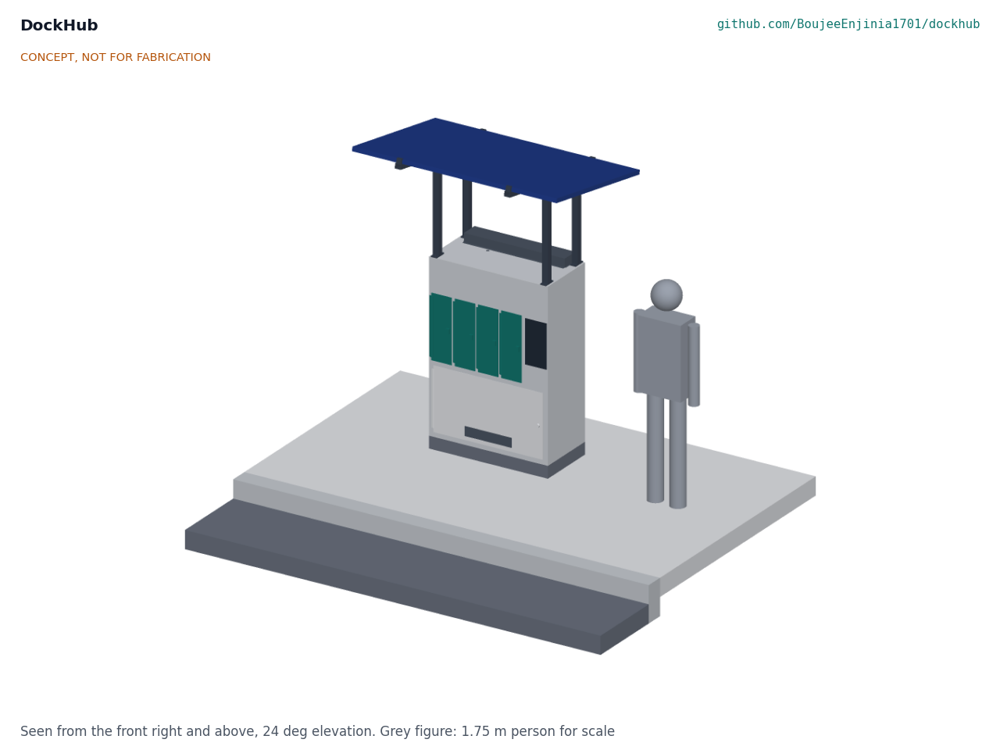
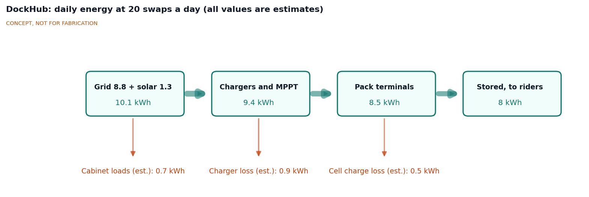
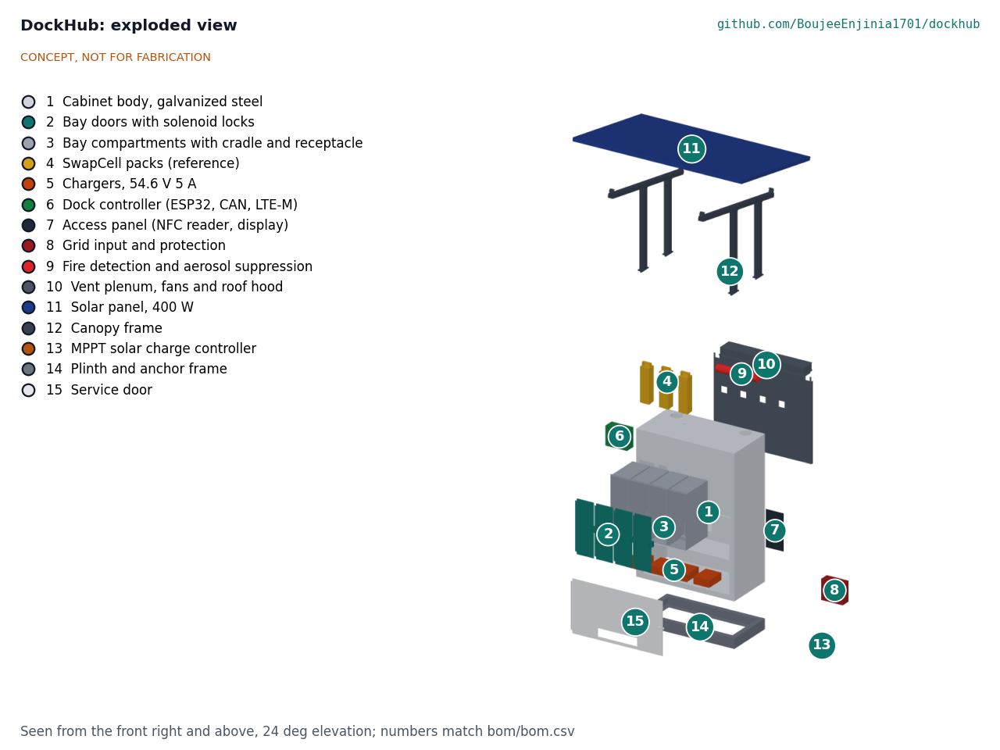
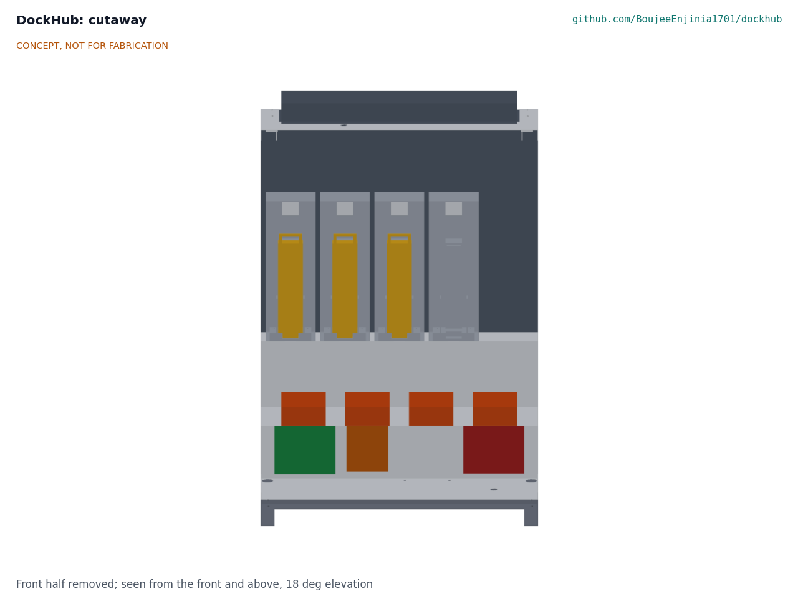

# DockHub design precis

## Summary

DockHub is a sidewalk cabinet, 1.0 m wide and 0.5 m deep, with four lockable steel bays that each hold and charge one SwapCell pack. A rider taps a card or phone, returns a flat pack to the empty bay and takes a charged one from another, in about 31 seconds. Each bay is a copy of the SwapCell wall dock built to SwapCell interface v0.3: a cradle with the blind-mate receptacle and its 10 kΩ INTERLOCK coding resistor, a certified 54.6 V 5 A charger and a CAN channel that checks the pack before charging. Every bay is its own steel compartment venting to a rear plenum, so a pack fault is detected, cut off and ducted away from the user side. A 400 W solar canopy shades the front and feeds bay 1; the grid supplies the rest through one single-phase circuit.

The sizing note DKH-CAL-001 confirms the swap time, charge speed, throughput (with four bays), grid draw, reach heights and footprint. It also shows two requirements not met: the canopy supplies 9.3 % of the charging energy against the relaxed 10 % target (R6), and the pack's 45 °C charge limit stops charging whenever ambient air is above about 29 to 39 °C (R9). Making the design buildable (DKH-DDR-003) added parts that take the cost to $1,214 against $1,200 with two of four bays fitted, so R16 is now not met as well. Fire containment (R8) and anchoring (R15) are at risk. Because a swap needs an empty bay, the four-bay station runs with three packs and the two-bay first prototype with one (DKH-REQ-001, DKH-DDR-001).

*Figure 1. DockHub on a sidewalk with a 1.75 m person for scale, four-bay fit with three packs and one empty bay. Rendered from the parametric model `cad/src/model.py`; concept, not for fabrication.*

## How it works

1. **Identify.** The rider taps an NFC card or phone on the access panel (BOM 7). The controller (6) checks the token against its local list, so the station works without a network connection.
2. **Return.** The empty bay's door (2) unlocks. The rider places the flat pack connector down in the cradle (3) and closes the door. The receptacle mates ground first, then power and CAN, and the interlock last. The 10 kΩ coding resistor in the INTERLOCK loop wakes the pack, as SwapCell interface v0.3 requires (item W).
3. **Check.** The controller sends the SwapCell heartbeat as a dock (host type 1) on that bay's CAN channel. The pack reports its identity, limits, temperatures and state of health. A pack with a fault, a damage flag or a state of health below 70 % stays locked in and is flagged for a technician; the rider still gets a charged pack.
4. **Release.** The door of the fullest healthy pack at 80 % state of charge or more unlocks; the rider lifts it out by its handle and closes the door. That bay becomes the empty bay for the next rider. The controller logs the pair of pack IDs against the rider token.
5. **Charge.** When the pack's limits allow, the controller closes that bay's DC contactor and its charger (5) runs CC-CV to 54.6 V. Bay 1 charges from the solar panel (11) through the MPPT controller (13) whenever the panel offers 50 W or more, and from its AC charger otherwise.
6. **Watch.** A thermistor at every receptacle, the pack's own temperature reports and a heat and smoke detector (9) are read every second. On an alarm the bay contactor opens, fans (10) run, the bay door stays locked, a light and buzzer warn people to stand back and an alert goes out by LTE-M.

*Figure 2. Daily energy at the design duty case of 20 swaps a day with four bays. All values are estimates from DKH-CAL-001.*

## Main components

Table 1. Main components. Numbers match the exploded view (Figure 3) and `bom/bom.csv`.

| BOM | Component | Concept choice | Notes |
| --- | --- | --- | --- |
| 1 | Cabinet body | 1.5 mm galvanized steel panels with folded flanges, joined with blind rivets (laser-cut front panel, back, two sides, roof, floor pan), 1,000 x 500 x 1,400 mm on a 100 mm plinth; bay deck at 0.70 m and charger shelf below; roof frame of two 40 x 40 x 4 mm angle beams under the canopy posts | IP54 target; light powder coat; blank plates over unfitted bays |
| 2 | Bay doors (4; 2 in the first prototype) | 2 mm steel doors on stainless piano hinges over 150 x 510 mm openings, with EPDM gaskets, 12 V fail-secure solenoid locks and door switches | Locked unless the controller releases them |
| 3 | Bay compartments (4; 2 in the first prototype) | Steel liner 180 x 358 x 530 mm per bay with a vent port to the plenum; cradle printed with its SwapCell guide faces, folded catch bracket with class D latch catch, and receptacle with 10 kΩ INTERLOCK coding resistor; NTC at the receptacle | Mirrors the SwapCell wall dock; pack stands connector down, lid face toward the rider |
| 4 | SwapCell packs (reference) | Interface v0.3: 46.8 V nominal, about 468 Wh, 2.85 kg, 340 x 90 x 80 mm body, 393 mm overall | Three resident with four bays, one with two; priced in the SwapCell project |
| 5 | Chargers (4; 2 in the first prototype) | Certified 54.6 V 5 A CC-CV lithium-ion chargers, about 303 W input each, power factor 0.9 or better | No custom mains electronics |
| 6 | Dock controller | ESP32, four SPI CAN controllers (one channel per bay), DC contactors, current sensors, LTE-M modem, SD card | One channel per bay because every SwapCell pack answers as node 0 by default |
| 7 | Access panel | NFC reader at 0.90 to 0.99 m, display and per-bay status lights, in a column at 0.85 to 1.21 m | Beside bay 4 |
| 8 | Grid input and protection | RCBO (30 mA), a breaker per charger, surge protection and lockable isolator | Installed by a qualified electrician |
| 9 | Fire detection and suppression | Heat and smoke detector under the roof, condensed-aerosol unit strapped to the back panel at the plenum top | Aerosol can suppress flame but cannot stop a cell in runaway |
| 10 | Vent plenum and roof vent hood | Rear plenum 137 mm deep behind the bays, two 120 mm fans under the roof blowing through it into a vent hood with slots in its back face and a rain lip; filtered intake in the service door | Takes charger heat and any vented gas up and out at the back |
| 11 | Solar panel | 400 W monocrystalline, tilted 10 degrees, front top edge at 2.45 m, rear edge underside at 2.21 m | Shades the rider and the front of the cabinet |
| 12 | Canopy frame | Four 50 x 50 x 3 mm steel posts on welded base and cap plates, bolted through the roof into the roof beams; two 50 x 40 x 3 mm rails; four panel end clamps | Front posts see about 1.25 kN of uplift at a 30 m/s gust |
| 13 | MPPT controller | Programmable lithium profile at 54.6 V, output limited to 5 A, feeding bay 1 | Bay 1 keeps its AC charger as a fallback |
| 14 | Plinth and anchor frame | Welded 100 x 50 x 5 mm steel channel frame flush with the body (1,000 x 500 mm), floor bolted to it, with four M12 anchor points to a concrete pad | Pad and anchors not in BOM; anchors need 3.8 kN design tension each |
| 15 | Service door | 920 x 520 mm steel door on a piano hinge over the technical compartment, with a cam lock and a filtered intake slot | Technician access only |

*Figure 3. Exploded view of the four-bay fit with BOM numbers. Line 16 (wiring and hardware) is not shown.*

*Figure 4. Section through the cabinet from the front: three packs (4) in their bay compartments (3), with bay 4 empty for the next return, above the chargers (5), controller (6), MPPT controller (13) and grid input (8); the plenum (10) is behind the bays and the vent hood above.*

The parametric model `cad/src/model.py` models every component as it is made or bought (DKH-DDR-003) and checks that no two overlap and that every joint touches. It exports STEP and STL files to `cad/step/` and `cad/stl/`, and the general arrangement drawing DKH-DWG-001 (Rev P2, `cad/drawings/`) shows the first-prototype fit with bays 1 and 2 fitted and bays 3 and 4 blanked.

## Numbers

All values are estimates from DKH-CAL-001, printed by `docs/04-calcs/sizing.py`.

Table 2. Key numbers.

| Quantity | Value | Requirement |
| --- | --- | --- |
| Swap time | 31 s by task analysis | R1 met |
| Charge time per bay | 1.2 h (20 to 80 %), 2.3 h full; 1.3 h from a 15 % return to the 80 % release level | R3 met |
| Energy per swap | 398 Wh stored, 465 Wh from the grid, about $0.093 at $0.20/kWh | |
| Throughput ceiling | 36 swaps a day with four bays (three packs, released full); 12 with two bays | |
| Design day, 20 swaps | Four bays: 20 served, longest wait 4 min. Two bays: 9 served | R4 met by four bays |
| Daily energy at 20 swaps | 8.76 kWh from the grid (0.72 kWh cabinet loads), 0.77 kWh from the panel, 7.58 kWh stored in packs | |
| Solar share | 9.3 % of charging energy; 11.4 % if flat packs are routed to bay 1 in daylight, at the cost of one rider in 20 | **R6 not met** |
| Peak grid draw | 1.25 kW with four chargers; 11.0 A at 120 V and 5.7 A at 230 V with power factor 0.95 | R5 met with power-factor-corrected chargers |
| Cabinet air at 45 °C ambient | about 49 °C (4.2 to 4.8 K rise with fans and sun on two walls) | |
| Charging ambient limit | Uninterrupted 5 A charging only below about 29 to 39 °C ambient; cold-soaked packs cannot start below about -1 °C | **R9 not met** |
| Fire response | Electronic detection latency 3.1 s; contactor opens in about 0.15 s | R7 not verifiable at TRL 3 |
| Mass | 217 kg for the two-bay prototype without packs; 247 kg for four bays with three packs | |
| Wind at a 30 m/s gust | 1,590 N uplift and 1.5 kN drag; 2.91 kN·m overturning against 0.53 kN·m self-weight | R15 at risk until anchors and pad are chosen |
| Parts cost | $1,214 with two of four bays fitted; $1,438 with four | **R16 not met** |

## Key design choices

Items 1 to 8 are the TRL 2 recommendations, decided by Amish on 2026-09-25: go with recommendation (DKH-DDR-001, DKH-DDR-002).

1. **One SwapCell dock per bay, in a shared cabinet.** Each bay reuses the SwapCell dock cradle, charger and handshake, so DockHub adds only the cabinet, access, safety and energy supply. One certified charger and one CAN channel per bay, rather than a shared charger matrix.
2. **Four bays in one row at hand height.** Keeps the footprint to 1.0 x 0.5 m and every handle within reach (0.73 to 1.10 m). The first prototype fits bays 1 and 2 to meet the budget; the cabinet is built for four.
3. **Separate steel compartment per bay with a rear plenum.** A venting pack's gas and flame go to the back and up through the roof fans and vent hood, not out of the door the user is standing at, and each pack is separated from its neighbors by two steel walls and an air gap.
4. **Doors stay locked during a fire alarm.** Keeps people from opening a bay with a pack in runaway; the fire service opens the cabinet with a key. The trade-off is that a rider cannot retrieve a returned pack during an alarm; a warning light and a sign explain why.
5. **Grid first, solar as a supplement.** The 400 W canopy stays as shade and supplement, and R6 is relaxed to 10 %. DKH-CAL-001 finds 9.3 %, so R6 is still not met; how to close the gap has no recommendation and is open for Amish (see Open questions).
6. **Solar feeds one bay directly through an MPPT controller.** Avoids an inverter and keeps all mains parts certified. It is also why the solar share is low: bay 1 can use the sun only while it holds a pack that needs charge.
7. **Offline-first access with NFC tokens.** The station keeps a token list and a log and syncs over LTE-M when it can, with an optional phone app.
8. **Pack health gate.** Packs below 70 % state of health, with a fault record or outside the charge temperature window are held for a technician, using the SwapCell in-pack log.

Engineering proposals made at TRL 3, decided by Amish on 2026-09-25: go with recommendation (DKH-DDR-001 items 12 and 13, DKH-DDR-002): build to SwapCell interface v0.3; release packs at 80 % state of charge or more; specify chargers with a power factor of 0.9 or better; a plinth flush with the body.

## Relationship to other lab projects

- **SwapCell** (pack, interface v0.3, wall dock). DockHub builds to interface v0.3 and changes nothing in it: coded INTERLOCK receptacle (item W), dock host type 1, class D catch (item V). A multi-bay dock still needs a CAN channel per bay, because packs default to node 0 and a node number would have to change at every station. SwapCell's 45 °C charge limit is what sets DockHub's hot-weather shortfall (R9); any question about it goes to that project, not changed here.
- **TwinKit** could later collect DockHub's logs alongside other lab devices. That is a suggestion only and is not part of this concept.

## Safety

> **Safety:** DockHub stores and charges lithium-ion packs of about 468 Wh each (three in the four-bay station, briefly four during a swap) next to a public walkway, from mains power. A cell in thermal runaway vents flammable, toxic gas and can ignite its neighbors; a pack fire is hard to extinguish and can re-ignite hours later. Treat the cabinet as a fire hazard at every stage of building and testing.

- **Lithium cells.** Charge only packs that pass the CAN check; never force-charge a pack that does not answer. Hold damaged, wet or faulted packs in their bay, uncharged, until a technician removes them to a fireproof container. Build and test the first cabinet on a non-combustible surface, outdoors or in a fire-rated space, with a lithium-rated extinguisher and a sand bucket at hand, and never leave it charging unattended until the detection and shutdown chain has been tested.
- **Fire containment is unproven.** The per-bay compartments and plenum are a concept. Whether they stop one pack's runaway from spreading (R8) can only be shown by a propagation test, which is TRL 4 or later work and on hold. Condensed-aerosol suppression can knock down flame but does not cool cells in runaway.
- **Mains voltage.** The technical compartment holds 120 V or 230 V AC wiring. It must be installed or checked by a qualified electrician under local electrical code, with an RCD (GFCI), per-charger breakers, surge protection, a lockable isolator and bonding of all metal parts to protective earth. Keep mains and the 54.6 V DC side physically separated and labeled. Use chargers with a power factor of 0.9 or better, or the circuit can be overloaded (DKH-CAL-001 section 6).
- **DC contacts and faults.** Receptacle contacts are at up to 54.6 V DC and a pack can deliver about 500 A into a short. Contacts stay dead until the SwapCell coded interlock and a valid heartbeat enable the pack. Each bay's DC line needs a fuse rated for 60 V DC with at least 1 kA breaking capacity.
- **Heat.** A sunlit cabinet in hot weather takes packs above their 45 °C charge limit; the pack and controller must pause charging, and the station must not be relied on for charging in the hottest hours.
- **Public siting and wind.** Place the cabinet away from building entrances, exits and windows, with the vent hood slots venting away from people. The canopy lifts and tips the cabinet in a strong gust: anchor the plinth to a concrete pad with four anchors rated for at least 3.8 kN design tension each, and bolt the canopy posts through to the roof frame. Keep a clear pedestrian path beside the cabinet.
- **Pinch, lifting and sharp edges.** Fold or hem all sheet edges; door locks must not pinch fingers. Canopy edges above head height need rounded corners. The cabinet weighs about 217 kg empty: move it with lifting equipment, not by hand.

## Open questions

- Pack ownership model: station-owned pool, rider-owned packs exchanged one for one, or fleet packs? Proposed, awaiting Amish.
- First pilot site and partner? Proposed, awaiting Amish.
- R6 is not met at 10 %: accept about 9 %, route flat packs to bay 1 in daylight and accept occasional waits, feed more bays from the sun, or drop the solar target? No recommendation yet; awaiting Amish.
- R9 is not met: accept daytime charging pauses in hot climates, add active cooling, narrow the design ambient, or ask SwapCell about the charge temperature limit? No recommendation yet; awaiting Amish.
- The two-bay first prototype holds only one pack and cannot run the duty case. Is that acceptable for a first build, given R16?
- Which lithium-ion propagation test and standard should a later version aim for, and can a garage-built cabinet realistically pass it?
- Is an aerosol unit worth its cost, or would sand or vermiculite-filled bay floors and a sealed, vented compartment be better?
- Which siting permissions apply on public sidewalks in the first pilot city, and who hosts the electrical supply?
- How are riders who do not want to share identity served (anonymous prepaid cards)?
